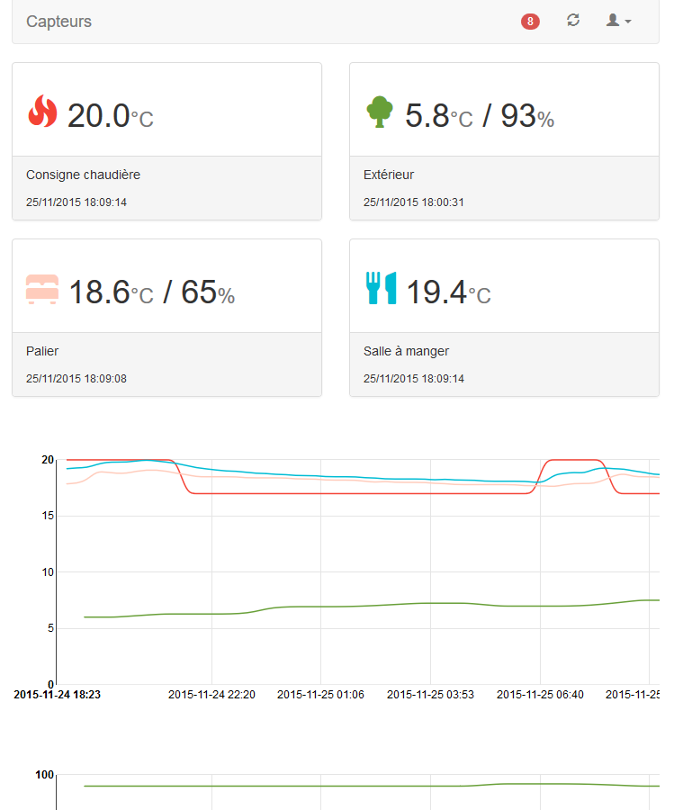

# Firebase based temperature / humidity logger

[](https://www.travis-ci.org/seblucas/firebase-sensor) [](https://coveralls.io/github/seblucas/firebase-sensor?branch=master)

## The idea

The idea came from [Tim Hodson](https://github.com/timhodson/rpi-sensor-station) who [blogged about it](http://timhodson.com/2014/04/rpi-sensor-network-collecting-the-data/) some time ago. So huge thanks to him.

## Firebase

### My goal

My goals were simple:
 * No limit in the number of sensors.
 * Adding a new sensor should only mean to modify a little the database and upload the readings but **never** change a single line of the Web UI.

### Structure

It was kind of hard for me to structure the base as I'm more used to relationnal databases. I ended up doing this :

```
root
  errors
    GUID
      time
      message
  readingCategories
    [hum|lum|temp]
      fractionSize
      label
      order
      unit
  readings
    room_id
      GUID
        time
        temp
        hum
        lum
  rooms
    room_id
      label
      color
      icon
      readings
        temp
        hum
        lum
```

### Security

TODO

### Todo

I'll probably add the battery level of some sensors, that will mean changing the database structure and the Web UI.

## The Web UI

### How does it look ?



### How do I make this work

Easy :
 * Get latest [release](https://github.com/seblucas/firebase-sensor/releases) and decompress it on your webserver
 * Deploy it to you firebase hosting.
 * Access it.

## Sending values to Firebase

TODO

## Monitoring

I wanted to make sure to be notified if no new data are added to Firebase (because I lost my Internet connection or a crash happenned).

So I created a Cloud function `monitor` to check the time of the last child of most of my reading . I simply compare the node's date with the current date and output a JSON object with the status.

The only thing left is to add a keyword monitor to [UptimeRobot](http://uptimerobot.com/).

## Licence

As stated in the LICENCE file, everything here is licensed under the GPL V2
